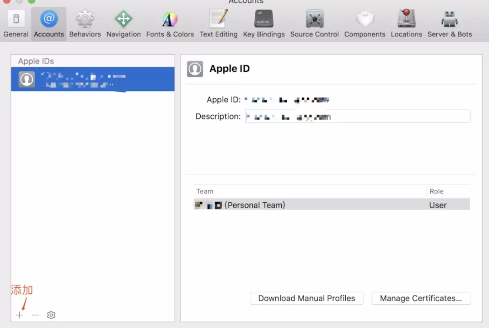
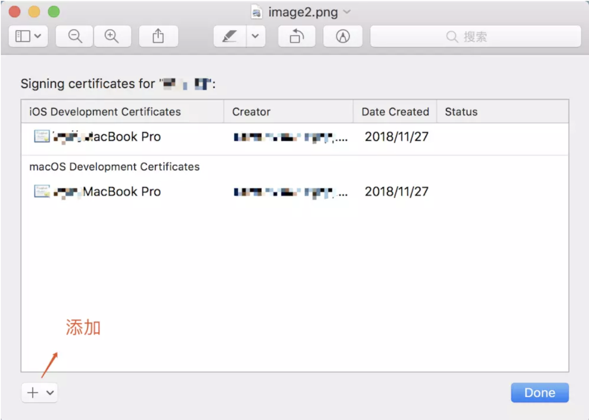
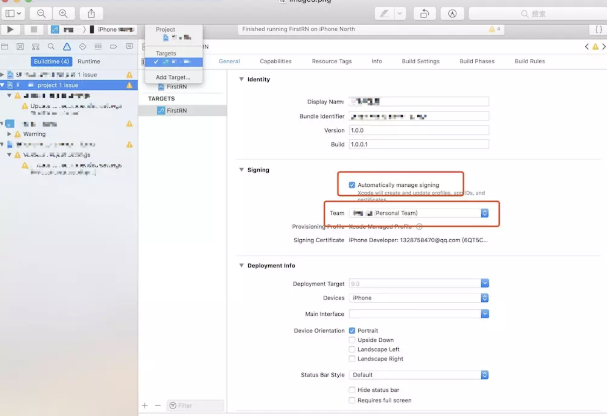
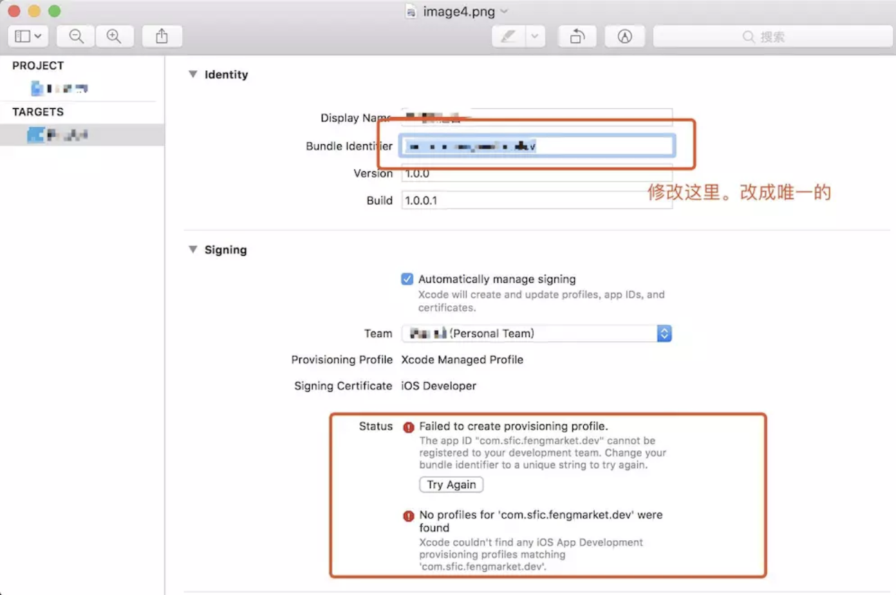
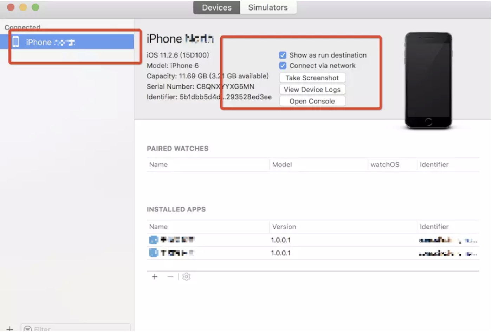
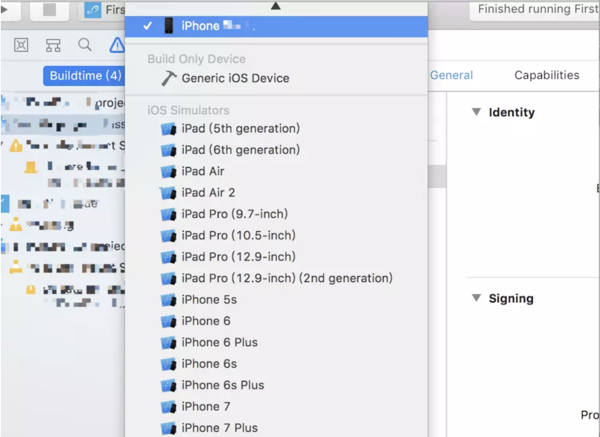

[原文](https://www.jianshu.com/p/8c99cb119bb3)
#### 1.添加 AppId

首先选择顶部菜单栏：

<ol>
  <li>
    xcode -> preference -> Account 添加你的 AppleID.
    
  </li>
  <li>
    添加完账号之后双击这条 team 或者点击manager certificates 就出现下图：选择ios development 和 macos development.
    
  </li>
  <li>
    添加账号之后, 勾选下图选项, 在team里选择你的AppleID.
    
  </li>
  <li>
    进行完上述操作之后, 如果报错了就修改Bundle Identifer改为唯一的, 多修改几次, 直到不报错.
    
  </li>
  <li>
    选择菜单栏 window -> Devices and simulator 出现下图把红框里这两个选项都勾选到.
    
  </li>
  <li>
    在下图这个菜单选择你的iPhone手机：前提是已经用数据线连好手机了, 并且很重要的一点是需要手机和Xcode刚刚添加的AppleID是一致的
    
  </li>
  <li>在手机的设置 -> 通用 -> 设备管理 下你会看到你的AppleID, 点一下弹出确认信任的弹框, 选择信任.</li>
  <li>点击运行的三角形图标按钮 RUN 一下.</li>
  <li>关注你的手机, 这时候 APP 应该已经下载好了, 可以愉快的调试了</li>
</ol>
